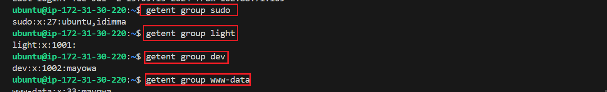

## HNG11 Internship

# Linux-user-creation-bash-script

- **DevOps Stage 1: Linux User Creation Bash Script
Task**

Your company has employed many new developers. As a SysOps engineer, write a bash script called **`create_users.sh`** that reads a text file containing the employee’s ***usernames and group names,*** where each line is formatted as user;groups.

The script should create users and groups as
specified, set up home directories with appropriate permissions and ownership, generate random passwords for the users, and log all actions to /**`var/log/user_management.log`**. Additionally, store the generated passwords securely in **`/var/secure/user_passwords.txt`**.

Ensure error handling for scenarios like existing users and provide clear documentation and comments within the script.

Also write a **`technical article`** explaining your script, linking back to HNG

- **Requirements:**

Each User must have a personal group with the same group name as the username, this group name will not be written in the text file.

A user can have multiple groups, each group delimited by comma `","`

Usernames and user groups are separated by semicolon `";"`- Ignore whitespace

e.g.
```
light; sudo,dev,www-data
idimma; sudo
mayowa; dev,www-data
```
For the first line, `light is username` and groups are `sudo, dev, www-data`

- **Technical Article:**

The article should be well-structured.

It MUST include at least two links to the HNG Internship websites; choose from any of 
```
https://hng.tech/internship
```
```
 https://hng.tech/hire
 ```
or 
```
https://hng.tech/premium
```
so others can learn more about the program.

The report should be concise.

The article should be public and accessible by anyone on the internet.

- **Acceptance Criteria:**

**Successful Run:** 

The mentors will test your script by supplying the name of the text file containing usernames and groups as the first argument to your script `(i.e bash create_user.sh <name-of-text-file> )` in an Ubuntu machine.

All users should be created and assigned to their groups appropriately.

The file `/var/log/user_management.log` should be created and contain a log of all actions performed by your script.

The file `/var/secure/user_passwords.csv` should be created and contain a list of all users and their passwords delimited by comma, and only the file owner should be able to read it.

The technical article is clear, concise and captures the reasoning behind each step in your script.

- **Submission Mode:**

Submit your task through the designated submission form. Ensure you’ve:

- Double-checked all requirements and acceptance criteria.

- Provided a link to your GitHub repository containing your file in the submission form.

- Thoroughly reviewed your work to ensure accuracy, functionality, and adherence to the specified guidelines before you submit it.

Provided a link to your technical article containing the reasoning behind your specific implementation.

**PS:**

Use a new repository for this task and your script should be in the root directory.
Your repo should contain only 2 files - README.md, create_users.sh

**Submission Deadline:**

The deadline for submissions is `Wed 3rd July, at 11:59 PM GMT. Late submissions will not be entertained. (edited)` 


The goal of this project is to automate the process of creating new user accounts and groups on a Linux system using a bash script.

## Steps

- 1. **Provission your virtual sever and ssh into it from your remote machine terminal**


- 2. **Create the script file:**
```
touch create_users.sh
chmod +x create_users.sh
```


- Open the `create_user.sh` script file with your prefered command line text editor (e.g., nano, vi):
and paste the bash script below.

```
#!/bin/bash

# Paths for logging and password storage
LOGFILE="/var/log/user_management.log"
PASSWORD_FILE="/var/secure/user_passwords.csv"

# Check if the input file is provided as expected
if [ -z "$1" ]; then
  echo "Error: No file was provided"
  echo "Usage: $0 <name-of-text-file>"
  exit 1
fi

# Ensure log and password directories exist
mkdir -p /var/secure
touch $LOGFILE $PASSWORD_FILE
chmod 600 $PASSWORD_FILE

generate_random_password() {
    local length=${1:-10} # Default length is 10 if no argument is provided
    tr -dc 'A-Za-z0-9!?%+=' < /dev/urandom | head -c $length
}

log_message() {
    echo "$(date '+%Y-%m-%d %H:%M:%S') - $1" >> $LOGFILE
}

# Function to create a user
create_user() {
  local username=$1
  local groups=$2

  if getent passwd "$username" > /dev/null; then
    log_message "User $username already exists"
  else
    useradd -m $username
    log_message "Created user $username"
  fi

  # Add user to specified groupsgroup
  groups_array=($(echo $groups | tr "," "\n"))

  for group in "${groups_array[@]}"; do
    if ! getent group "$group" >/dev/null; then
      groupadd "$group"
      log_message "Created group $group"   
    fi
    usermod -aG "$group" "$username"
    log_message "Added user $username to group $group"
  done

  # Set up home directory permissions
  chmod 700 /home/$username
  chown $username:$username /home/$username
  log_message "Set up home directory for user $username" 

  # Generate a random password
  password=$(generate_random_password 12) 
  echo "$username:$password" | chpasswd
  echo "$username,$password" >> $PASSWORD_FILE
  log_message "Set password for user $username"
}

# Read the input file and create users
while IFS=';' read -r username groups; do
  create_user "$username" "$groups"
  echo $username
done < "$1"

log_message "User creation process completed."


```


- 3.  **Create the User List File**

Create a file named `user_list.txt`

```
touch user_list.txt
```

Open the user_list.txt with your preffered command line text editor:

Add the user and group information
```
light; sudo,dev,www-data
idimma; sudo
mayowa; dev,www-data
```


- 4. **Run the Script**

Execute the script with the user list file as an argument:

```
sudo bash create_users.sh user_list.txt
```
***The above script will create users, groups, and set up home directories. It will also log actions to /var/log/user_management.log and store passwords in /var/secure/user_passwords.csv.***

- **Verify the outcome of the script to ensure it is performing it's intended task.**

Check the log file:
```
sudo cat /var/log/user_management.log
```


Check the password file:
```
sudo cat /var/secure/user_passwords.csv
```


- Verify that groups were created and users were added to the groups using the `get entries` command:

```
getent group light
getent group sudo
getent group dev
getent group www-data
```


Visit the [HNG Internship website](https://hng.tech/internship) to learn more about the HNG Internship Programe
